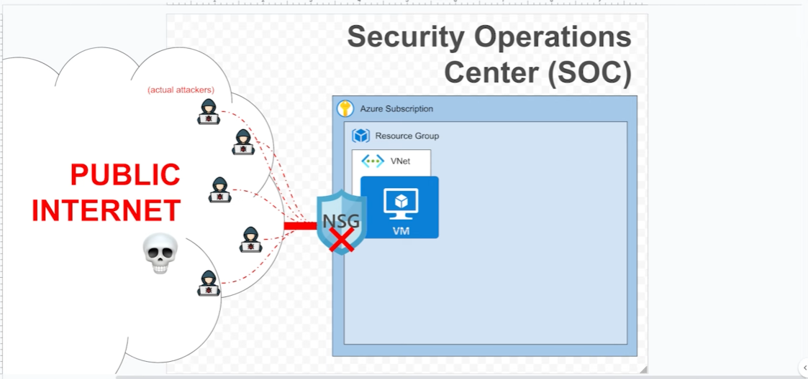
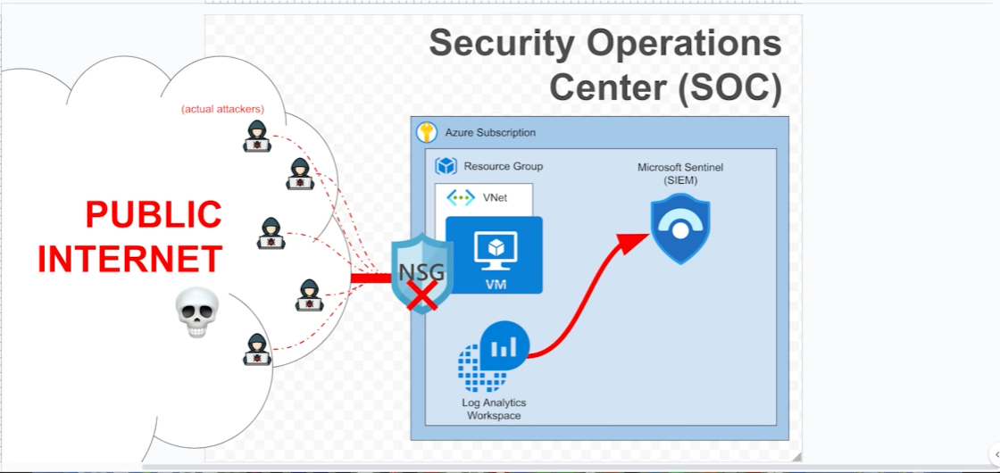
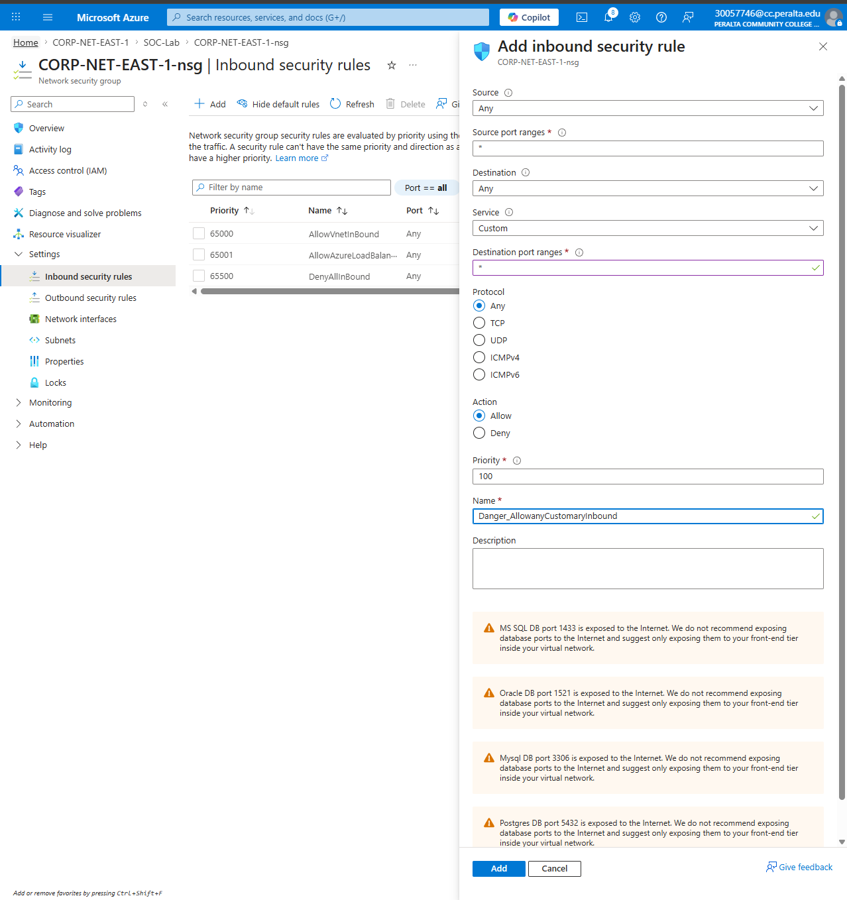
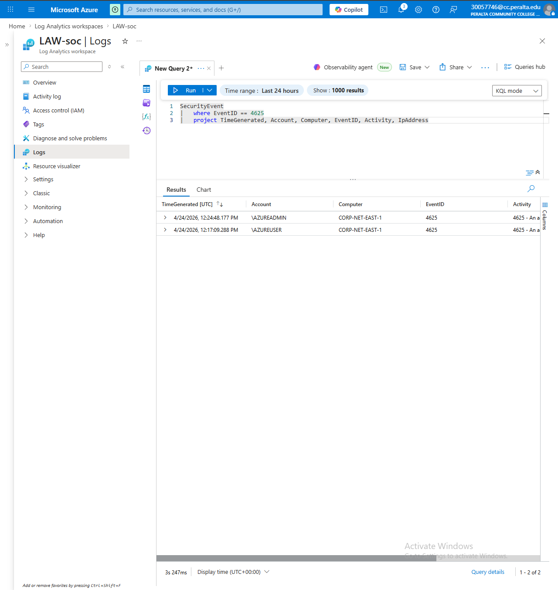
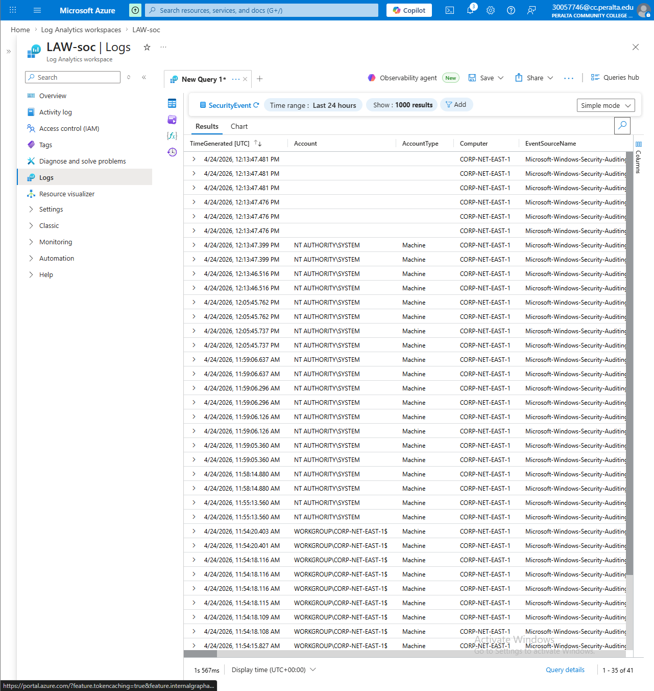
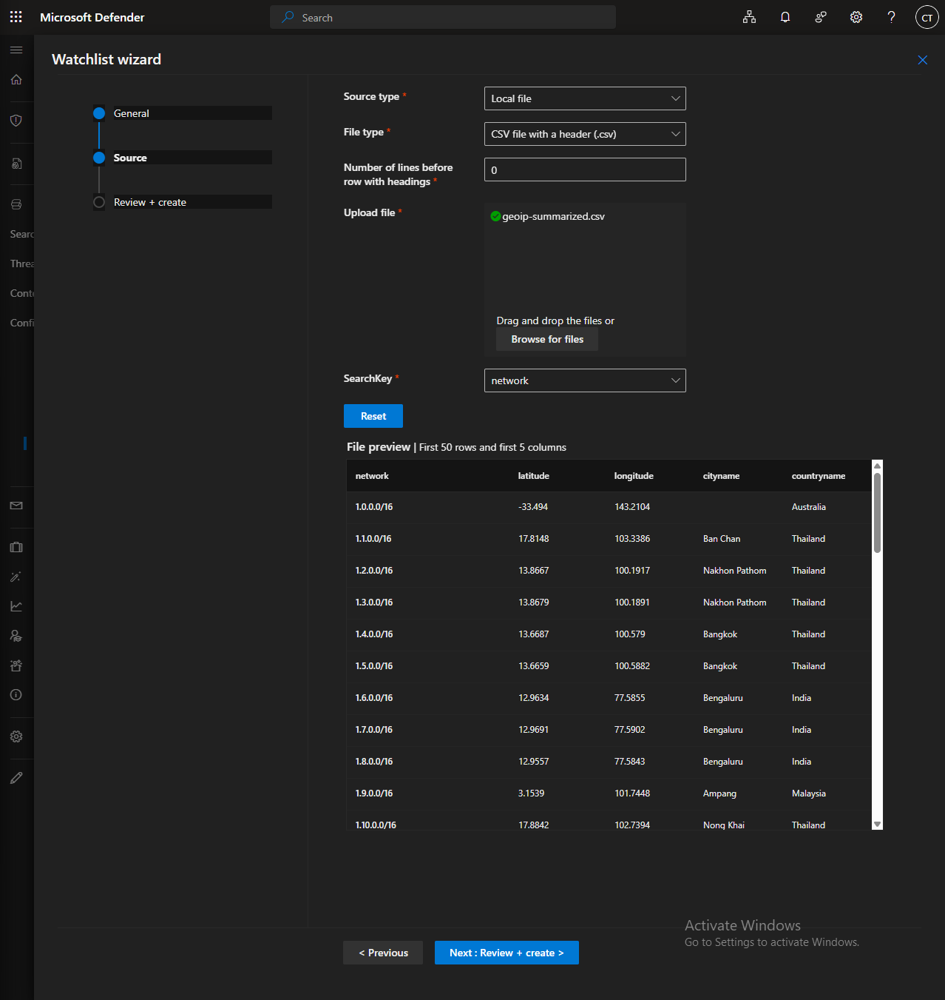

Azure SOC Home Lab — SIEM with Live Attack Data
Overview
Built a cloud-based Security Operations Center (SOC) in Microsoft Azure using a free subscription. Deployed a Windows VM as a honeypot exposed to the public internet, collected real-world attack telemetry, and analyzed it using Microsoft Sentinel (SIEM) with KQL queries and a live geolocation attack map.

Architecture

The lab simulates a real enterprise SOC environment with the following components:

Honeypot VM — Windows 10 Enterprise N exposed to the internet to attract brute-force and login attempts
Network Security Group (NSG) — Configured to allow all inbound traffic, intentionally removing default protections
Log Analytics Workspace — Centralized log repository ingesting Windows Security Events
Microsoft Sentinel — Cloud-native SIEM used for threat detection, log analysis, and visualization



Steps Taken
1. Deployed Honeypot VM

Created a Windows 10 VM in Azure (East US) inside a dedicated resource group SOC-Lab
Opened all inbound ports via a custom NSG rule (Danger_AllowAnyCustomaryInbound, priority 100) to expose the VM to the public internet



Disabled Windows Defender Firewall on all profiles (Domain, Private, Public) inside the VM to maximize attack surface
Verified public reachability by pinging the VM's public IP from a local machine

2. Built the Log Pipeline

Created a Log Analytics Workspace (LAW-soc) to serve as the central log repository
Deployed Microsoft Sentinel and connected it to the workspace
Installed the Windows Security Events solution from the Sentinel Content Hub
Created a Data Collection Rule (DCR) using the Windows Security Events via AMA connector to forward all security events from the VM to Sentinel

3. Analyzed Attack Data with KQL
Queried ingested logs using Kusto Query Language (KQL) to surface failed login attempts:
kqlSecurityEvent
| where EventID == 4625
| project TimeGenerated, Account, Computer, EventID, Activity, IpAddress

Within hours of deployment, the VM was receiving unauthorized login attempts from external sources, confirming the honeypot was live and attracting real attackers.

4. Enriched Logs with Geolocation Data

Downloaded a GeoIP database (geoip-summarized.csv) mapping IP ranges to city/country
Uploaded it to Microsoft Sentinel as a Watchlist via the Microsoft Defender portal
Used the watchlist to enrich attacker IP addresses with geographic location data for attack map visualization

 

Skills Demonstrated

-Azure cloud infrastructure (VMs, NSGs, resource groups)

-SIEM deployment and configuration (Microsoft Sentinel)

-Log ingestion pipeline (AMA connector, Data Collection Rules)

-Threat detection with KQL

-Geolocation enrichment and log analysis

-Honeypot design and real-world attack observation


Tools & Technologies
Microsoft Azure, Microsoft Sentinel,  Log Analytics, KQL, Windows Security Events, NSG, AMA, Data Connector, Microsoft Defender Portal


# 🛡️ Azure SOC Home Lab — SIEM with Live Attack Data

## Overview
Built a cloud-based Security Operations Center (SOC) in Microsoft Azure using a free subscription. Deployed a Windows VM as a honeypot exposed to the public internet, collected real-world attack telemetry, and analyzed it using Microsoft Sentinel (SIEM) with KQL queries and a live geolocation attack map.

---

## 🏗️ Architecture


The lab simulates a real enterprise SOC environment with the following components:

| Component | Description |
|-----------|-------------|
| **Honeypot VM** | Windows 10 Enterprise N exposed to the internet to attract brute-force attempts |
| **NSG** | Configured to allow all inbound traffic, intentionally removing default protections |
| **Log Analytics Workspace** | Centralized log repository ingesting Windows Security Events |
| **Microsoft Sentinel** | Cloud-native SIEM used for threat detection, log analysis, and visualization |


---

## 🔧 Steps Taken

### 1. Deployed Honeypot VM
- Created a Windows 10 VM in Azure (East US) inside a dedicated resource group `SOC-Lab`
- Opened all inbound ports via a custom NSG rule (`Danger_AllowAnyCustomaryInbound`, priority 100) to expose the VM to the public internet


- Disabled Windows Defender Firewall on all profiles (Domain, Private, Public) inside the VM to maximize attack surface
- Verified public reachability by pinging the VM's public IP from a local machine

---

### 2. Built the Log Pipeline
- Created a **Log Analytics Workspace** (`LAW-soc`) as the central log repository
- Deployed **Microsoft Sentinel** and connected it to the workspace
- Installed the **Windows Security Events** solution from the Sentinel Content Hub
- Created a **Data Collection Rule (DCR)** using the Windows Security Events via AMA connector to forward all security events from the VM to Sentinel

---

### 3. Analyzed Attack Data with KQL
Queried ingested logs using Kusto Query Language (KQL) to surface failed login attempts:

```kql
SecurityEvent
| where EventID == 4625
| project TimeGenerated, Account, Computer, EventID, Activity, IpAddress
```


> ⚠️ Within hours of deployment, the VM was receiving unauthorized login attempts from external sources, confirming the honeypot was live and attracting real attackers.


---

### 4. Enriched Logs with Geolocation Data
- Downloaded a GeoIP database (`geoip-summarized.csv`) mapping IP ranges to city/country
- Uploaded it to Microsoft Sentinel as a **Watchlist** via the Microsoft Defender portal
- Used the watchlist to enrich attacker IPs with geographic location data for attack map visualization

 

---

## 📋 Skills Demonstrated
- Azure cloud infrastructure (VMs, NSGs, resource groups)
- SIEM deployment and configuration (Microsoft Sentinel)
- Log ingestion pipeline (AMA connector, Data Collection Rules)
- Threat detection with KQL
- Geolocation enrichment and log analysis
- Honeypot design and real-world attack observation

---

## 🛠️ Tools & Technologies


